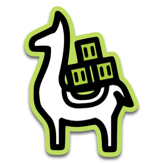
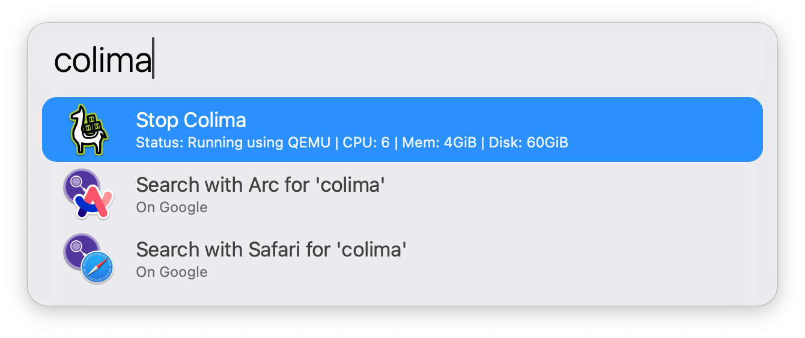

#  Colima Alfred Workflow
Colima is a container runtime tipically used instead of docker desktop. This workflow allows to check the status, start and stop colima.

# Setup
Install colima: https://github.com/abiosoft/colima

# Usage
Just write `colima` and press `<enter>` to start or stop.

# TODOs:
- Check result of toggling colima and send the correct text as notification. Currently it says "started|stopped" regardless of command output
